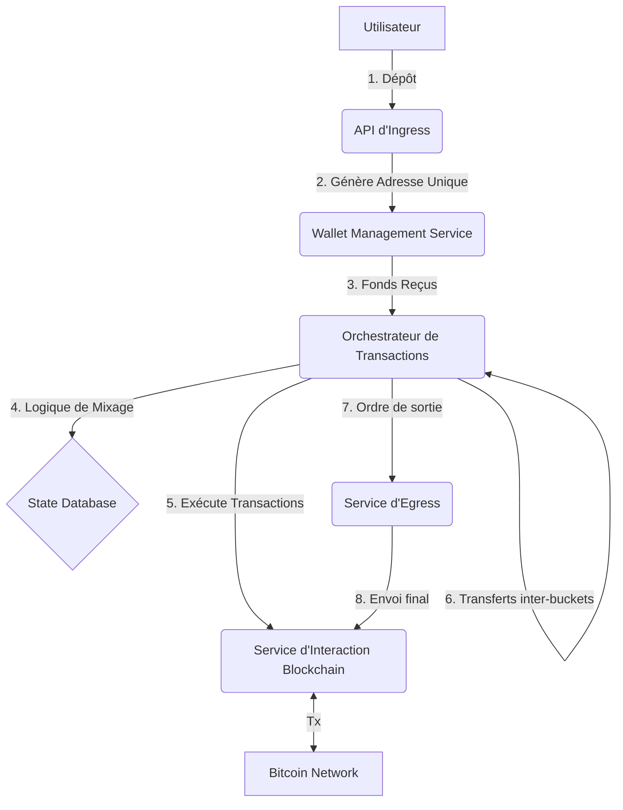

### **Étape 1 : Intervention de "Ton Second" – Clarification et Stratégie**

**Rôle** : Ton Second
**Objectif** : Challenger l'idée, la simplifier et définir les axes stratégiques.

Bonjour. L'idée est puissante, mais elle recèle une grande complexité. Avant d'aller plus loin, clarifions l'intention et la stratégie.

**1. Questions de clarification :**
*   **Quel est l'objectif final ?** Est-ce un outil de protection de la vie privée (défensif), un service commercial (offensif), ou une recherche théorique ? La réponse conditionne 90% des décisions techniques et légales.
*   **Quel est le modèle de menace ?** Contre qui se protège-t-on ? Un analyste blockchain amateur ? Une entreprise comme Chainalysis ? Une agence gouvernementale ? Le niveau de sophistication de l'algorithme en dépend directement.
*   **Comment est gérée la liquidité ?** Pour être efficace, un mixeur doit mélanger les fonds de *plusieurs* utilisateurs. Si le système ne traite que tes fonds, les liens sont plus faciles à recréer. Ton système gère-t-il un pool commun dans les buckets ?

**2. Options Stratégiques (Pattern "Double Réponse") :**

*   **Version Safe (Outil de Confidentialité Augmentée)** :
    *   **Concept** : Un système décentralisé ou semi-décentralisé, inspiré de CoinJoin. Les utilisateurs collaborent pour créer des transactions communes, brisant les liens de propriété.
    *   **Avantages** : Risque juridique plus faible (tu fournis un outil, pas un service de mixage centralisé), pas de garde des fonds.
    *   **Inconvénients** : Moins efficace pour de grands volumes, nécessite la participation d'autres utilisateurs.

*   **Version Ambitieuse (Service de Mixage Actif)** :
    *   **Concept** : Le système que tu décris. Une plateforme centralisée qui prend en dépôt les fonds, les mélange activement via ses buckets, et les restitue.
    *   **Avantages** : Très grande efficacité si l'algorithme est bon, contrôle total sur le processus.
    *   **Inconvénients** : **Risque juridique et sécuritaire maximal**. C'est une activité de "Money Services Business" (MSB) dans de nombreuses juridictions, et une cible prioritaire pour les hackers.

**Décision requise :** Quelle direction stratégique choisissons-nous ? Pour la suite de cette analyse, nous allons partir sur la **Version Ambitieuse**, car elle correspond à ta description initiale.

---

### **Étape 2 : Intervention de "l'Architecte IA & CTO" – Architecture Technique**

**Rôle** : Architecte IA & CTO
**Objectif** : Définir l'architecture du système, les composants et les défis techniques.

Parfait. Conception de l'architecture pour le service de mixage actif.

**Architecture Système (Vue d'ensemble)**

**Composants Clés :**

1.  **API d'Ingress** : Le point d'entrée. Reçoit la demande de l'utilisateur (montant, adresses de sortie) et communique avec le Wallet Service pour fournir une adresse de dépôt unique.
2.  **Wallet Management Service** : Le cœur sécuritaire.
    *   Utilise une architecture HD (Hierarchical Deterministic) pour générer des milliers d'adresses pour les buckets.
    *   **Sécurité critique** : Les clés privées ne doivent JAMAIS être stockées en clair. Utilisation obligatoire d'un HSM (Hardware Security Module) ou d'un service comme HashiCorp Vault.
3.  **Orchestrateur de Transactions (Le Cerveau)** :
    *   Contient l'algorithme de mixage. C'est la "sauce secrète".
    *   **Logique** : Doit introduire de l'aléa pour déjouer l'analyse :
        *   **Timing** : Délais aléatoires entre les transactions (secondes, minutes, voire heures).
        *   **Montants** : Fractionnement et regroupement des montants pour ne jamais avoir `input = output`.
        *   **Chemin** : Le parcours des fonds à travers les comptes et les buckets doit être non déterministe.
4.  **State Database** : Base de données (ex: PostgreSQL) qui suit l'état de chaque mixage : à quel utilisateur appartiennent les fonds, dans quel bucket ils se trouvent, etc. **Données extrêmement sensibles.**
5.  **Service d'Interaction Blockchain** : Service qui construit, signe (en appelant le Wallet Service) et diffuse les transactions sur le réseau Bitcoin. Doit gérer les confirmations et les frais de réseau (fees).

**Défis Techniques Majeurs :**

*   **Analyse de Graphe (Chain Analysis)** : Ta principale menace. Les outils modernes ne suivent pas seulement les flux, ils analysent les "empreintes" des wallets (type de client, gestion des frais). Le système doit imiter un comportement humain et aléatoire.
*   **Coût des Transactions** : Un mixage impliquant des dizaines, voire des centaines de transactions, coûtera cher en frais Bitcoin. Ce coût doit être répercuté sur l'utilisateur.
*   **Scalabilité & Anonymat** : L'anonymat provient du "bruit". Plus il y a d'utilisateurs et de fonds dans les buckets en même temps, plus le traçage est difficile. Le système doit être conçu pour être multi-tenant dès le départ.

---

### **Étape 3 : Intervention des "Experts" – Analyse des Risques**

**Rôle** : Juriste & Sécurité (MODE_COMPLIANCE)
**Objectif** : Évaluer les risques critiques non-techniques.

Conformément au pipeline, une analyse des risques est obligatoire avant de poursuivre.

**Analyse des Risques (Matrice Impact / Probabilité)**

| Risque | Impact | Probabilité | Note | Action |
| :--- | :--- | :--- | :--- | :--- |
| **Poursuites Judiciaires (AML/CTF)** | Catastrophique (9) | Très Élevée (8) | **72** | **Consultation juridique immédiate.** Opérer un tel service est illégal dans la plupart des pays sans licences MSB/KYC, ce qui neutralise l'objectif. |
| **Sanctions Gouvernementales (OFAC)** | Catastrophique (10)| Moyenne (6) | **60** | Le service peut être blacklisté (cf. Tornado Cash). Toute interaction avec devient illégale pour les entités régulées. |
| **Vol de Fonds par Hacking** | Critique (8) | Élevée (7) | **56** | **Audit de sécurité externe obligatoire.** C'est une cible de choix pour les attaquants. |
| **Inefficacité du Mixage** | Critique (7) | Moyenne (5) | **35** | L'algorithme doit être audité par des experts en analyse blockchain pour valider son efficacité. Fausse sensation de sécurité. |
| **Erreur Opérationnelle (Perte de clés)**| Critique (8) | Faible (3) | **24** | Mettre en place des procédures de sauvegarde et de récupération de clés draconiennes (multi-sig, etc.). |

**Conclusion des experts :**
Le risque juridique est le bloqueur principal. Il est **extrêmement élevé** et précède même les défis techniques. Le risque de sécurité est tout aussi critique. Ignorer ces points serait irresponsable.

---

### **Étape 4 : Intervention de "PMO" – Plan d'Action Initial**

**Rôle** : PMO (Project Management Office)
**Objectif** : Structurer les prochaines étapes en un plan d'action clair.

**Plan d'Action (Pattern "Décomposition")**

1.  **Phase 0 : Validation Juridique (Obligatoire - 2 semaines)**
    *   **Action** : Consulter un cabinet d'avocats spécialisé en crypto-actifs pour évaluer la légalité du projet selon la juridiction visée.
    *   **Livrable** : Un avis juridique formel sur les risques et les obligations réglementaires.

2.  **Phase 1 : Recherche & Spécifications (4 semaines)**
    *   **Action** : Étudier en détail les techniques d'analyse blockchain existantes et les algorithmes de mixage (CoinJoin, TumbleBit, etc.).
    *   **Action** : Rédiger des spécifications techniques détaillées pour l'algorithme de mixage ("Orchestrateur").
    *   **Livrable** : Document d'architecture détaillé et analyse comparative des technologies de mixage.

3.  **Phase 2 : Développement du PoC (Proof of Concept) (8 semaines)**
    *   **Action** : Développer une version fonctionnelle sur un **testnet Bitcoin** (jamais en mainnet à ce stade).
    *   **Objectif** : Valider la faisabilité technique du Wallet Service et de l'Orchestrateur.
    *   **Livrable** : Un prototype fonctionnel sur testnet.

---

### **Synthèse Exécutive (APS)**

**Rôle** : APS
**Objectif** : Fournir une synthèse claire et des recommandations.

**Synthèse des points clés :**

1.  **Concept** : Ton idée est celle d'un "mixeur de cryptomonnaie", un système conçu pour obscurcir l'origine des fonds. L'architecture proposée (buckets, transactions internes) est une base de travail viable.
2.  **Faisabilité Technique** : Le projet est techniquement complexe mais réalisable. Les principaux défis sont la conception d'un algorithme de mixage résistant à l'analyse de graphe moderne et la sécurisation absolue des fonds des utilisateurs.
3.  **Risques** : Les risques sont **extrêmes**, principalement sur le plan juridique. Opérer ce service sans se conformer aux régulations anti-blanchiment (AML) est illégal dans la plupart des grandes juridictions et a mené à des poursuites pénales pour les opérateurs de services similaires.
4.  **Prochaines Étapes** : La priorité absolue n'est pas technique mais juridique.

**Actions recommandées :**

*   **Action 1 (Immédiate)** : **Ne pas commencer le développement**. Engager une consultation juridique spécialisée pour comprendre le cadre légal.
*   **Action 2** : Si le cadre légal le permet, lancer la Phase 1 (Recherche) pour affiner l'algorithme afin qu'il puisse déjouer les outils d'analyse actuels.
*   **Action 3** : Reconsidérer l'option stratégique "Safe" (outil de type CoinJoin) qui présente un profil de risque potentiellement plus acceptable.

Ce système est désormais clarifié. Nous avons une architecture, une analyse des risques et un plan d'action. La balle est dans ton camp pour la décision stratégique et l'analyse juridique.
