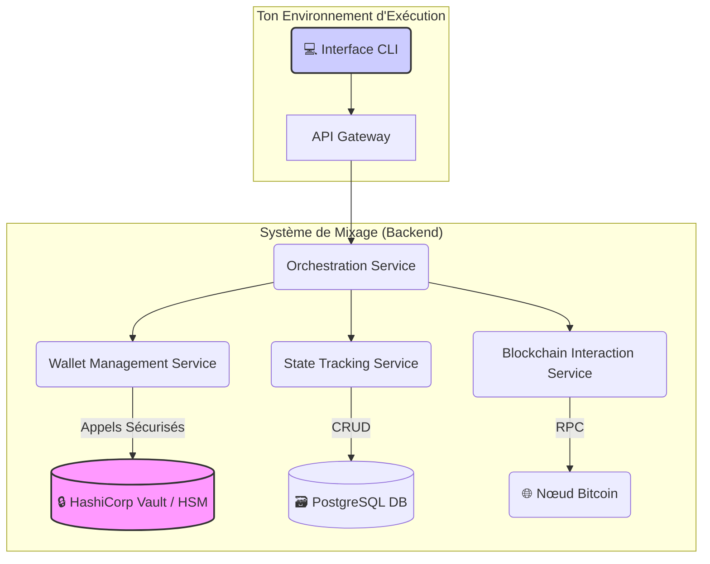

Ok. Activation du système APS.

Ton intention est claire : transformer l'idée d'un outil de mixage privé en un plan d'implémentation technique détaillé et structuré, en respectant une architecture moderne de microservices et un stack technologique précis.

Conformément à notre pipeline, je vais orchestrer les personas nécessaires. L'analyse juridique de Dr. Legis a validé la prémisse d'un **usage strictement personnel**, ce qui constitue notre "guardrail" fondamental. Les principaux intervenants pour cette phase seront l'**Architecte IA & CTO** pour la conception, puis le **PMO** et le **Lead Dev** pour la planification et le découpage des tâches.

---

### **Étape 1 : Intervention de l'Architecte IA & CTO – Conception de l'Architecture Technique**

**Rôle** : Architecte IA & CTO
**Objectif** : Définir l'architecture microservices du système en .NET 8/9, en respectant les principes SOLID et les bonnes pratiques REST.

Parfait. Compte tenu de la contrainte d'un usage privé, nous allons concevoir une architecture robuste, sécurisée et modulaire, mais sans la complexité inutile d'une gestion multi-utilisateurs.

#### **Architecture Microservices Cible**

Le système sera composé de 5 services principaux communiquant via des API REST internes, et d'une interface en ligne de commande (CLI) pour que tu puisses l'opérer.

1.  **Wallet Management Service (WMS)**
    *   **Responsabilité (SOLID)** : Unique responsable de la génération, du stockage et de l'utilisation des clés privées. Il ne connaît RIEN de la logique de mixage.
    *   **Fonctionnalités** :
        *   Créer des portefeuilles HD (Hierarchical Deterministic).
        *   Générer de nouvelles adresses à la demande pour les buckets.
        *   Signer des transactions brutes qui lui sont soumises.
    *   **Sécurité** : C'est le cœur sécuritaire. Les clés privées seront gérées via **HashiCorp Vault** (ou un équivalent) et ne seront jamais en mémoire vive du service. Le WMS y accède via une API sécurisée.
    *   **Stack** : .NET 8, API REST minimale (CRUD pour les wallets, une route pour la signature).

2.  **State Tracking Service (STS)**
    *   **Responsabilité** : Gérer l'état de la base de données. Il est le seul service autorisé à communiquer avec la base de données PostgreSQL.
    *   **Fonctionnalités** :
        *   Suivre les fonds : à quelle étape du mixage ils se trouvent, dans quel bucket, etc.
        *   Enregistrer l'historique de toutes les transactions internes et externes.
    *   **Stack** : .NET 8, API REST CRUD, Entity Framework Core pour l'ORM.

3.  **Blockchain Interaction Service (BIS)**
    *   **Responsabilité** : Communiquer avec le réseau Bitcoin. Il abstrait la complexité du client Bitcoin.
    *   **Fonctionnalités** :
        *   Scanner la blockchain pour détecter les dépôts sur les adresses de collecte.
        *   Diffuser les transactions signées sur le réseau.
        *   Estimer les frais de transaction (fees).
    *   **Stack** : .NET 8, API REST, client RPC pour communiquer avec un nœud Bitcoin (local ou distant).

4.  **Orchestration Service (OS)**
    *   **Responsabilité** : C'est le cerveau du système. Il contient toute la logique de mixage et coordonne les autres services.
    *   **Fonctionnalités** :
        *   Exécuter l'algorithme de mixage (délais aléatoires, fractionnement des montants, sélection des chemins).
        *   Demander des adresses au WMS.
        *   Construire des transactions non signées.
        *   Demander la signature au WMS.
        *   Demander la diffusion au BIS.
        *   Mettre à jour l'état via le STS.
    *   **Stack** : .NET 8, API REST.

5.  **Interface CLI (Command-Line Interface)**
    *   **Responsabilité** : Permettre à l'utilisateur (toi) d'interagir avec le système de manière sécurisée.
    *   **Fonctionnalités** :
        *   `mix start --amount 0.1 --outputs "addr1,addr2"`
        *   `mix status --id <mix_id>`
        *   `wallet new`
    *   **Stack** : Application console .NET 8. Elle communiquera avec l'Orchestration Service via son API.

---

### **Étape 2 : Intervention du PMO & Lead Dev – Plan d'Implémentation Détaillé**

**Rôle** : PMO & Lead Dev
**Objectif** : Découper l'architecture en un plan de développement par phases, avec des tâches claires et des responsabilités assignées.

Très bien. Voici le plan d'action découpé en phases logiques. Nous commencerons par un Proof of Concept sur le **Testnet Bitcoin** pour valider la mécanique de base en toute sécurité.

#### **Phase 0 : Préparation & Sécurité (Durée : 1 semaine)**
*   **Objectif** : Mettre en place les fondations du projet.
*   **Tâches :**
    1.  **Création du Dépôt Git** : Initialiser le repo avec la structure de dossiers définie. (`/src/WalletService`, `/src/OrchestrationService`, etc.) - **Lead Dev**
    2.  **Configuration de l'Environnement de Dev** : Mettre en place Docker & Docker Compose pour lancer tous les microservices, la BDD et le nœud Bitcoin (testnet) localement. - **Lead Dev**
    3.  **Définition des Contrats d'API** : Utiliser OpenAPI (Swagger) pour définir la communication entre les services. - **CTO & Lead Dev**
    4.  **Mise en place de Vault** : Déployer une instance de HashiCorp Vault pour la gestion des secrets. - **CTO**

#### **Phase 1 : Proof of Concept (PoC) sur Testnet (Durée : 3 semaines)**
*   **Objectif** : Valider la chaîne de transactions de bout en bout avec une logique de mixage simplifiée (ex: 3 buckets, 1 transaction par bucket).
*   **Tâches :**
    1.  **Dev - Wallet Management Service (v1)** : Implémenter la génération d'adresses (testnet) et la signature de transactions basiques. - **Lead Dev**
    2.  **Dev - Blockchain Interaction Service (v1)** : Implémenter la détection de dépôts et la diffusion de transactions sur le testnet. - **Lead Dev**
    3.  **Dev - Orchestration Service (v1)** : Coder une logique de transfert simple et séquentielle : Dépôt -> Compte A -> Compte B -> Sortie. - **Lead Dev**
    4.  **Tests d'Intégration (PoC)** : Valider que le flux complet fonctionne en initiant une transaction manuellement. - **Lead Dev & CTO**

#### **Phase 2 : MVP (Minimum Viable Product) - Outil fonctionnel privé (Durée : 4 semaines)**
*   **Objectif** : Implémenter la logique de mixage avancée et l'interface de contrôle.
*   **Tâches :**
    1.  **Dev - Orchestration Service (v2)** : Implémenter l'algorithme de mixage complet (délais, montants et chemins aléatoires). - **Lead Dev**
    2.  **Dev - State Tracking Service (v1)** : Mettre en place la base de données et l'API pour un suivi robuste des états. - **Lead Dev**
    3.  **Dev - Interface CLI (v1)** : Créer les commandes de base pour lancer et suivre un mixage. - **Lead Dev**
    4.  **Revue de Sécurité** : Auditer le code, en particulier la communication avec Vault et la gestion des clés. - **CTO & Expert Sécurité**
    5.  **Documentation** : Rédiger un `README.md` clair sur comment compiler, déployer et utiliser l'outil. - **Lead Dev**

---

### **Synthèse Exécutive (APS)**

**Plan d'Implémentation Synthétique**

| Phase | Objectif Principal                                       | Livrables Clés                                           | Rôles Principaux     | Durée Estimée |
| :---- | :------------------------------------------------------- | :------------------------------------------------------- | :------------------- | :------------ |
| **0** | **Fondations** - Mettre en place l'environnement et la sécurité. | Dépôt Git structuré, Environnement Docker fonctionnel.   | Lead Dev, CTO        | 1 semaine     |
| **1** | **PoC sur Testnet** - Valider le flux technique de base.   | Un script capable de faire un transfert A->B->C sur testnet. | Lead Dev             | 3 semaines    |
| **2** | **MVP Privé** - Avoir un outil fonctionnel et sécurisé.    | Interface CLI, Algorithme de mixage avancé, Doc.         | Lead Dev, CTO, Sécu. | 4 semaines    |

