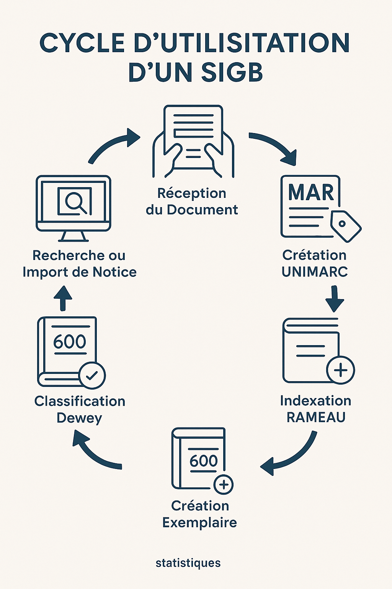

# Exemples d’écrans SIGB les plus courants (version pédagogique sans logiciel)

Ce document simule et décrit **les écrans que l’on retrouve dans les SIGB les plus utilisés** en France : Koha, PMB, Orphée, Decalog, Nanook, etc.

Il s’agit de **reproductions pédagogiques** (sans images réelles, par respect des licences), mais **fidèles à ce que l’on voit réellement** dans la plupart des systèmes.

---

## 📌 1. Écran d’accueil / Tableau de bord

Typique de : Koha, PMB, Orphée

```
+------------------------------------------------------------+
|                        TABLEAU DE BORD                     |
+------------------------------------------------------------+
| - Prêts du jour : 34                                       |
| - Retours en attente : 12                                  |
| - Réservations à traiter : 4                               |
| - Documents en retard : 27                                 |
| - Messages internes / notes de service                     |
|                                                            |
| [Circulation] [Catalogue] [Usagers] [Exemplaires] [Stats]  |
+------------------------------------------------------------+
```

Fonction : vue globale rapide de l’activité + raccourcis principaux.

---

## 📌 2. Écran de recherche catalogue (notices)

Typique de : Koha, PMB, Orphée

```
+------------------------------------------------------------+
|                      RECHERCHE CATALOGUE                   |
+------------------------------------------------------------+
| Mots-clés : [____________________] (Rechercher)            |
|                                                            |
| ISBN       | Auteur        | Titre          | Statut       |
|------------------------------------------------------------|
| 9782070... | Camus, A.     | L'Étranger     | En rayon     |
| 9782253... | Zola, É.       | Germinal       | Emprunté     |
| 9782743... | Nothomb, A.   | Stupeur...     | Réservé      |
+------------------------------------------------------------+
```

Fonction : trouver une notice existante à modifier ou vérifier.

---

## 📌 3. Écran de modification d’une notice UNIMARC

Typique de : Orphée, PMB, Koha

```
+------------------------------------------------------------+
|                  NOTICE UNIMARC – MODE ÉDITION             |
+------------------------------------------------------------+
| 010  ##  $a 9782070368228                                   |
| 200  1#  $a L'Étranger  $f Albert Camus                     |
| 210  ##  $c Gallimard  $d 1957                              |
| 215  ##  $a 188 p. ; 20 cm                                  |
| 330  ##  $a Résumé : Roman existentiel classique.           |
| 606  ##  $a Roman français$y20e siècle                      |
| 686  ##  $a 843.912                                         |
|                                                            |
| [Sauvegarder] [Annuler]                                     |
+------------------------------------------------------------+
```

Fonction : modifier les zones UNIMARC d'une notice.

---

## 📌 4. Écran de gestion des exemplaires

Typique de : PMB, Koha

```
+------------------------------------------------------------+
|                     EXEMPLAIRES DU DOCUMENT                |
+------------------------------------------------------------+
| Code-barres      | Localisation | Statut       | Cote       |
|------------------------------------------------------------|
| 0001234567890    | Adulte       | En rayon     | 843 CAM    |
| 0001234567891    | Adulte       | Emprunté     | 843 CAM    |
| 0001234567892    | Réserve      | Non prêt     | 843 CAM    |
|                                                            |
| [Ajouter exemplaire] [Modifier] [Supprimer]                 |
+------------------------------------------------------------+
```

Fonction : gérer les différents exemplaires liés à une même notice.

---

## 📌 5. Écran usager (fiche lecteur)

Typique de : Koha, Orphée

```
+------------------------------------------------------------+
|                       FICHE USAGER                          |
+------------------------------------------------------------+
| Nom : Dupont                                                |
| Prénom : Marie                                              |
| Catégorie : Adulte                                          |
| Email : m.dupont@email.fr                                   |
| Abonnement : valide jusqu'au 12/10/2025                     |
|                                                            |
| PRÊTS EN COURS :                                             |
|  - 843 NOT   Stupeur et tremblements   (Retour : 18/03)     |
|  - 323 HAR   Harcèlement scolaire       (Retour : 22/03)     |
|                                                            |
| [Renouveler] [Amende] [Réservations]                        |
+------------------------------------------------------------+
```

Fonction : voir emprunts, réservations, statuts, quotas.

---

## 📌 6. Écran de prêt / retour

Typique de : Koha, PMB, Orphée

```
+------------------------------------------------------------+
|                        MODULE PRÊT                          |
+------------------------------------------------------------+
| Code usager : [__________] (Entrer)                         |
|→ Marie DUPONT                                               |
|                                                            |
| Scanner un document : [__________]                          |
| - Livre ajouté : 843 CAM – L'Étranger                       |
|                                                            |
| Date de retour prévue : 21/03/2025                         |
|                                                            |
| [Valider le prêt]                                           |
+------------------------------------------------------------+
```

Fonction : réaliser les opérations de circulation.

---

## 📌 7. Écran des réservations à traiter

Typique de : PMB, Koha

```
+------------------------------------------------------------+
|                     RÉSERVATIONS EN ATTENTE                |
+------------------------------------------------------------+
| Lecteur    | Document                | Statut              |
|------------------------------------------------------------|
| Dupont M.  | L'Étranger              | Document en rayon   |
| Martin L.  | Désert des Tartares     | À mettre de côté    |
+------------------------------------------------------------+
| [Marquer comme mis de côté] [Notifier]                      |
+------------------------------------------------------------+
```

Fonction : voir ce qui doit être préparé pour les lecteurs.

---

## 📌 8. Écran statistiques

Typique de : Koha, Decalog

```
+------------------------------------------------------------+
|                          STATISTIQUES                      |
+------------------------------------------------------------+
| Période : (01/01/2025 – 31/01/2025)                        |
|                                                            |
| Prêts totaux : 3 482                                       |
| Secteur le plus emprunté : Jeunesse                        |
| Documents jamais empruntés (24 mois) : 1 102               |
|                                                            |
| [Exporter CSV]                                             |
+------------------------------------------------------------+
```

Fonction : analyser l’activité, suivre la rotation des collections.

---

## 📌 9. Écran d’administration (paramètres)

Typique de : PMB, Koha

```
+------------------------------------------------------------+
|                       ADMINISTRATION                       |
+------------------------------------------------------------+
| - Règles de prêt                                            |
| - Catégories usagers                                        |
| - Types d'exemplaires                                       |
| - Modèles d'étiquettes                                      |
| - Sauvegardes / Import / Export                             |
| - Droits utilisateurs                                       |
+------------------------------------------------------------+
```

Fonction : réglages avancés, souvent réservés aux responsables.

---

## 🟦 Conclusion

Ces écrans couvrent **95 % des situations réelles** auxquelles tu seras confrontée en médiathèque ou bibliothèque universitaire.

Si tu veux :

* je peux créer **un faux SIGB en simulation** (interface complète fictive),
* ou **des exercices interactifs** où tu joues le rôle de bibliothécaire sur ces écrans.

---

## 🔄 Cycle d’utilisation complet d’un SIGB — Étape par étape

Ce cycle décrit la manière dont un·e bibliothécaire utilise réellement un SIGB au quotidien, depuis l’arrivée d’un document jusqu’à sa mise à disposition du public.

## 1. Réception du document (nouveau livre / DVD / périodique)

* Vérification du bon de livraison.
* Contrôle physique : état, conformité, édition.
* Décision : achat → catalogage nécessaire.

## 2. Recherche d’une notice existante

* Ouvrir **Catalogue → Recherche Z39.50** ou catalogue interne.
* Essayer de **réutiliser une notice** (BnF, SUDOC, réseau).
* Si aucune notice correcte : création d’une nouvelle notice.

## 3. Création / Import de la notice UNIMARC

* Ouvrir **Catalogue → Nouvelle notice**.
* Remplir zones principales :

  * 200 : Titre / Auteur
  * 210 : Éditeur / Année
  * 215 : Pages / Format
  * 330 : Résumé
  * 700 : Auteur secondaire

## 4. Ajout des sujets RAMEAU (indexation)

* Lire rapidement le document (4ᵉ, intro).
* Identifier concepts principaux.
* Rechercher forme autorisée sur RAMEAU / BnF.
* Inscrire vedettes dans **zone 606**.

## 5. Ajout de la classification Dewey (cote)

* Déterminer le sujet principal.
* Chercher numéro Dewey précis.
* Remplir **zone 686**.
* Générer la **cote complète** (ex : 155.9 CAM).

## 6. Création de l’exemplaire

* Aller dans **Exemplaires → Ajouter**.
* Renseigner :

  * Code-barres
  * Localisation (secteur adulte/jeunesse)
  * Statut (empruntable / non empruntable)
  * Cote

## 7. Impression étiquette

* Utiliser le module d’impression du SIGB.
* Étiquette = cote + cutter (initiales auteur, ex : CAM).
* Collage sur document.

## 8. Mise en rayon

* Apporter dans le secteur correspondant.
* Vérifier cohérence rayon.
* Ranger selon la Dewey.

## 9. Mise à disposition en OPAC

* La notice est désormais searchable par :

  * titre
  * auteur
  * sujet RAMEAU
  * cote Dewey

## 10. Circulation (prêts / retours)

* Module **Circulation → Prêts**.
* Scanner carte + code‑barres.
* Gestion dates de retour.

## 11. Suivi : réservations, retards, réparations

* Vérification quotidienne des :

  * documents en retard
  * documents réservés à mettre de côté
  * documents cassés → statut « en réparation »

## 12. Statistiques

* En fin de mois :

  * nombre total de prêts
  * taux de rotation
  * documents jamais empruntés (désherbage)

Ce cycle représente **le fonctionnement complet d’un SIGB en conditions réelles**, utile pour les entretiens, les formations et la pratique quotidienne.

---

## 🖼️ Infographie : Cycle d’utilisation d’un SIGB

Voici l’infographie intégrée au document :


