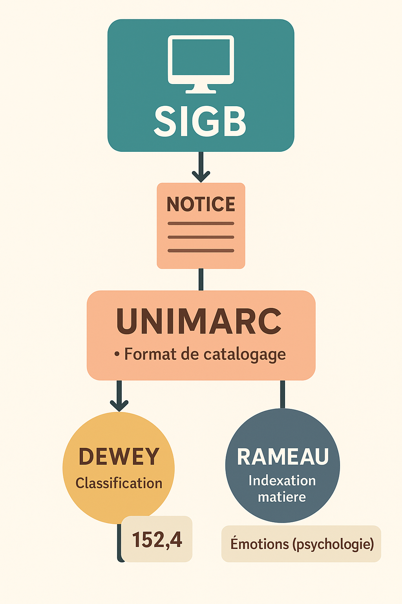

# Comprendre l’articulation SIGB – UNIMARC – Dewey – RAMEAU

Ce document explique de manière claire comment les outils fondamentaux des bibliothèques s’articulent entre eux :  

- **SIGB** = le logiciel  
- **UNIMARC** = la structure des notices  
- **Dewey** = la classification  
- **RAMEAU** = l’indexation matière  

---

## 🎯 Résumé express  

**Le SIGB est le logiciel dans lequel on crée les notices selon UNIMARC.  
Dans ces notices, on ajoute la classification Dewey (pour la cote) et les vedettes RAMEAU (pour les thèmes).**

---

## 🧩 1. SIGB = le logiciel central

Exemples : Koha, PMB, Orphée, Decalog…

Le **SIGB** gère :  

- les prêts, retours, réservations,  
- les usagers,  
- les notices bibliographiques,  
- les exemplaires,  
- les statistiques.

👉 **C’est dans le SIGB que tu catalogues et que tu utilises UNIMARC, Dewey et RAMEAU.**

---

## 📚 2. UNIMARC = le format de catalogage

UNIMARC est **la structure de la notice**, c’est-à-dire la façon officielle d’organiser les informations.

Quelques zones clés :  

- **200** : Titre / Auteur  
- **210** : Éditeur / Date  
- **215** : Description matérielle  
- **330** : Résumé  
- **606** : Sujets RAMEAU  
- **686** : Cote Dewey  
- **700** : Auteurs secondaires

👉 **UNIMARC = squelette de la notice.  
SIGB = où tu l’utilises.**

---

## 🏷️ 3. RAMEAU = l’indexation matière  

RAMEAU sert à répondre à la question :  
➡️ *De quoi parle ce document ?*

Ce sont des vedettes matière (mots-clés normalisés).  
Elles se mettent dans **la zone 606 UNIMARC**.

Exemples :  

- `Émotions (psychologie)`  
- `Parenté$xAspects sociaux`  
- `Écologie$xEffets du changement climatique`

👉 **RAMEAU rend la recherche thématique possible dans le catalogue.**

---

## 🗂️ 4. Dewey = la classification / cote

La Dewey sert à :  
➡️ *classer et ranger physiquement les documents*.  

Elle se note dans **la zone 686 UNIMARC**.

Exemples :  

- **152.4** → émotions  
- **843.92** → roman français contemporain  
- **910.4** → récits de voyage  
- **597.8** → requins

👉 **Dewey = numéro sur l’étiquette du livre.**

---

## 🔗 5. Comment tout s’articule ?

Voici l’ordre réel dans lequel un·e bibliothécaire fait les choses :

### 1) Dans le SIGB, tu ouvres ou crées une notice  

➡️ Le formulaire est en UNIMARC.

### 2) Tu saisis les zones UNIMARC  

→ Titre, auteurs, éditeur, résumé…

### 3) Tu ajoutes les sujets RAMEAU  

→ Zone **606**.

### 4) Tu ajoutes la classification Dewey  

→ Zone **686**, puis la cote est imprimée.

### 5) Tu valides  

→ Le SIGB enregistre la notice, visible dans l’OPAC.

---

## 🧠 6. Métaphore pour tout retenir  

Imagine un bâtiment :

- **SIGB** = la ville où se trouvent tous les bâtiments  
- **UNIMARC** = l’architecture du bâtiment  
- **RAMEAU** = les pièces et leur fonction  
- **Dewey** = l’adresse du bâtiment

Tout est complémentaire.

---

## 🧾 7. Tableau récapitulatif

| Élément | Rôle | Où apparaît-il ? | Sert à quoi ? |
|--------|------|------------------|---------------|
| **SIGB** | Logiciel | Partout | Gestion documentaire et du public |
| **UNIMARC** | Structure | Notice | Organiser et décrire le document |
| **RAMEAU** | Sujet / Thèmes | Zone 606 | Recherche thématique |
| **Dewey** | Classification | Zone 686 + Cote | Rangement en rayon |

---

## 🏁 Conclusion  

UNIMARC, Dewey et RAMEAU sont trois outils complémentaires **utilisés ensemble dans le SIGB** pour décrire, ranger et retrouver les documents.

---

## 🔜 Ce qui arrive bientôt (TODO)

- Fiche A4 synthèse SIGB/UNIMARC/Dewey/RAMEAU  
- Exercice pratique complet de catalogage  
- Simulation technique d’entretien sur ces notions  
